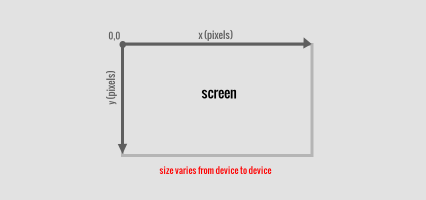
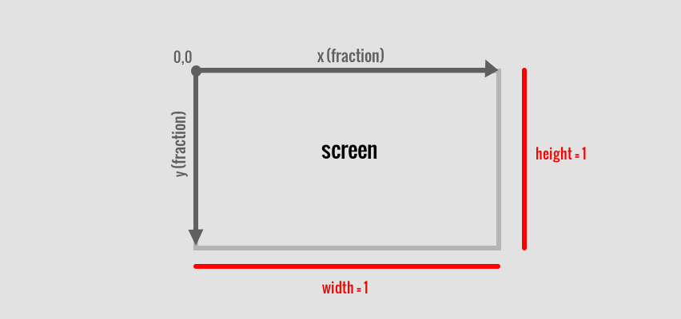
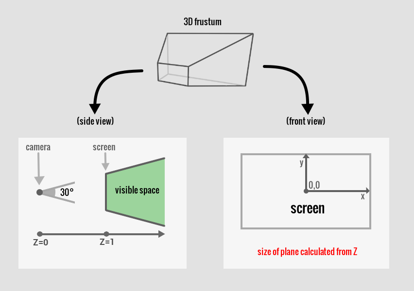
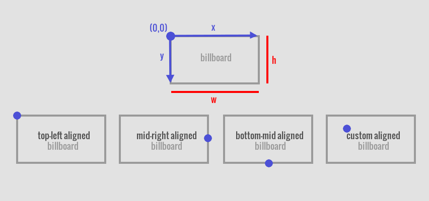
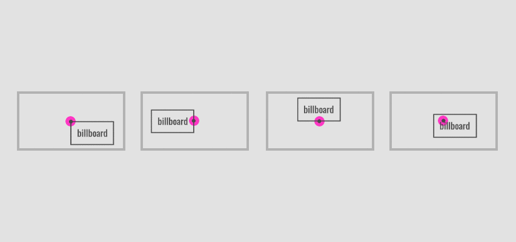

# Drawing to the Screen

This game engine supports placing 2D images in 3D space.  In order to do this,
we must establish some coordinate frames and some methods for drawing to them.

## Coordinate Frames

There are three coordinate frames that we use for different purposes.  Each was
created to make drawing conceptually easier in a specific context.

### The Screen

The actual screen of the game is composed of pixels, of course.  Since we want
the game to fit the screens of many different mobile devices, our expected
screen width and height in pixels will vary widely.

Because of the wide variety of screen sizes, we never use pixel coordinates
directly in the game.  Instead we use what we call "window" coordinates,
"layout" coordinates, or "space" coordinates.  We discuss these next.

### Window Coordinates

The base coordinate system we use is a sort of normalized screen, using what we
call "window" coordinates.  The virtual "window" still stretches to fit the
entire screen, but is always 720 units high, regardless of the actual height in
pixels.  Its width varies with the aspect ratios for different devices.

### Layout Coordinates

When placing things on the HUD or menus, it's useful to anchor them using
percentage positions.  For example, if we want a button at the middle of the
screen, its position is x=50% and y=50%, defined as percentages of the screen
dimensions.  Thus we define "layout" coordinates in a frame that stretches to
fit the screen, but whose width and height are set to 1.

### Space Coordinates

When placing images in 3D space, we use "space" coordinates defined by a
frustum.  To construct the frustum, we define the screen to be at z=1, and the
vertical field of view to be 30º.

You may have noticed that the XY origin is now defined at the center of the
screen. This allows us to project any coordinate to the screen by dividing the
XY coordinates by Z, a simple 3D -> 2D perspective transformation.

## Drawing

### Billboards

We define a "billboard" to simplify the task of drawing an image with a given
position, alignment and size.  You can think of it as a picture frame that you
can move around in 3D space, as long as it is facing forward.  The methods in
the billboard calculate pixel positions from the properties discussed next.

#### Size

The size of the billboard is defined in window coordinates.  Keep in mind that
this is the size of the billboard when it is flush against the screen.  Its
apparent size will diminish as expected if it is positioned further out in
space.

#### Alignment

The alignment of the billboard is controlled by a relative "anchor" point.  For
example, if we want a billboard to be center-aligned, then its anchor is at the
center of the image.  If we want a billboard to be right-aligned, then its
anchor is at the right side of the image.

#### Position

We move the billboard to a given position by "anchoring" it there at its anchor
point.  The position can be defined in "layout", "window", or "space"
coordinates.

#### Scale

We can modify the scale of the billboard to enlarge or shrink it.

