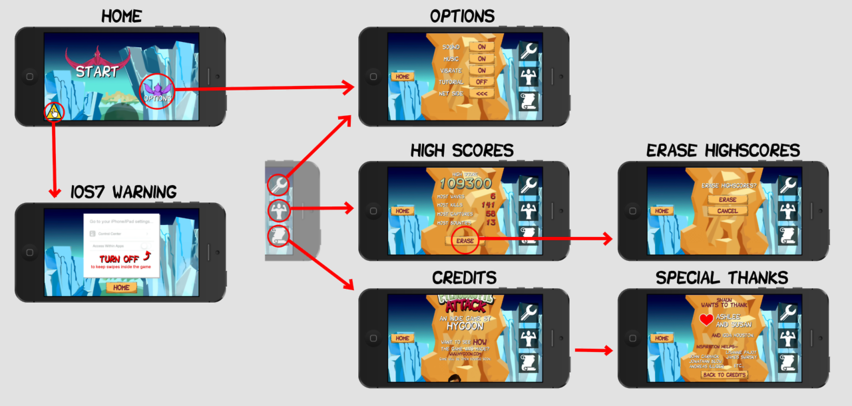
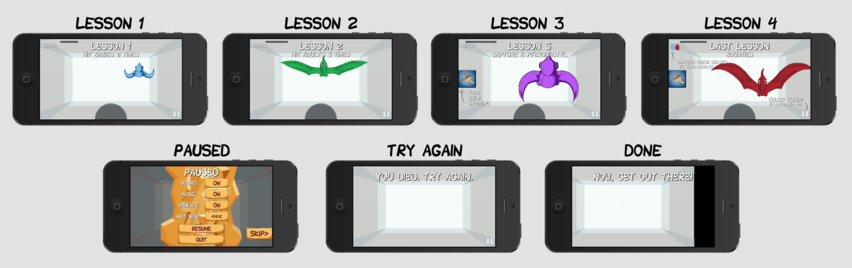
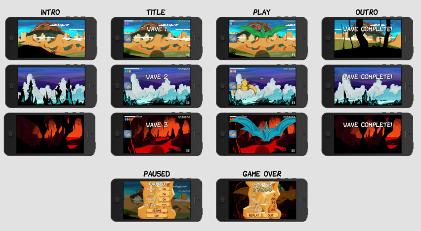

## Flow

The main menu has a simple flow to allow you to start the game, change options,
view high scores, view credits, and view an iOS suggestion on better
playability.

The first time you start the game, you will be taken to the tutorial session
that guides you through four lessons.  Each lesson will repeat until you pass.
Completion of the final lesson starts the game proper.

The game proceeds through several waves of pterodactyls.  Each wave begins with
the camera flying into a new environment, and ends with the camera flying out.
You can pause to adjust options or quit.  When the game ends, you are presented
a "game over" screen where you can see how you did and decide to replay or
quit.

