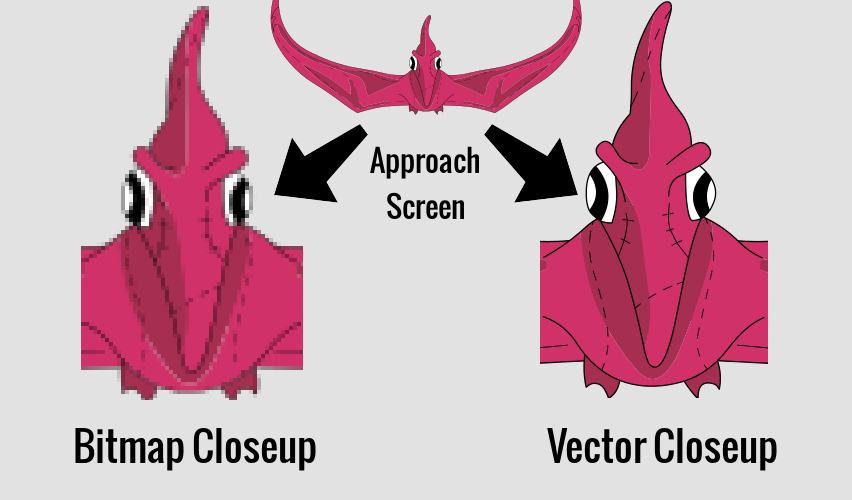
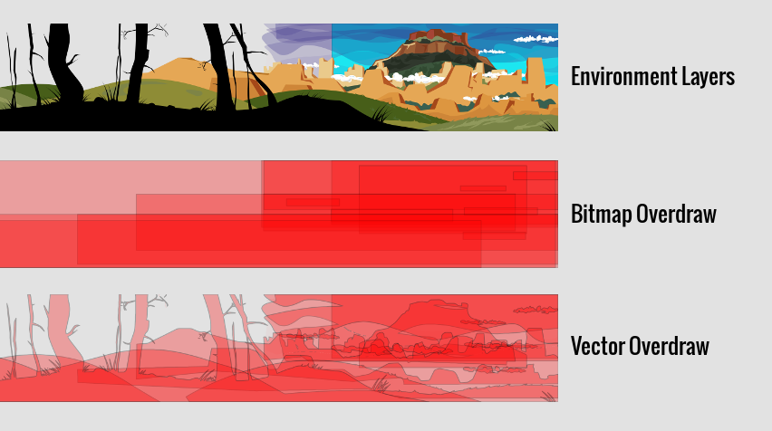
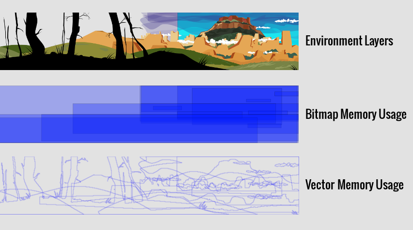
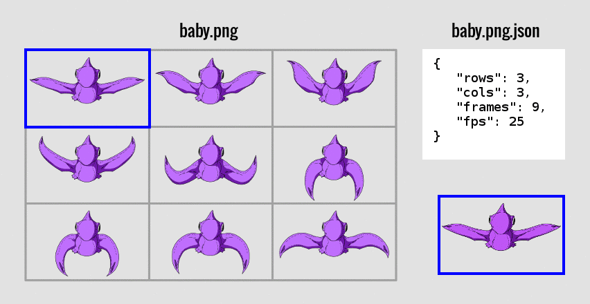
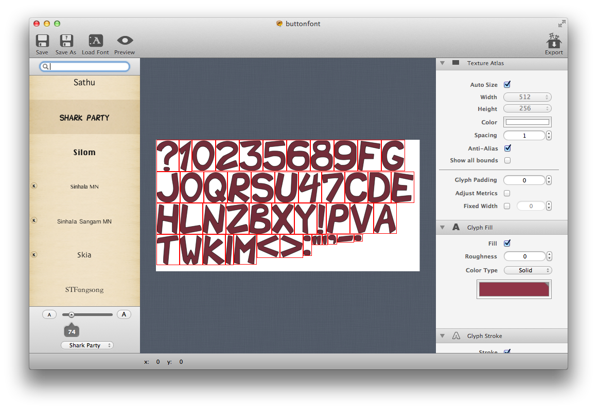
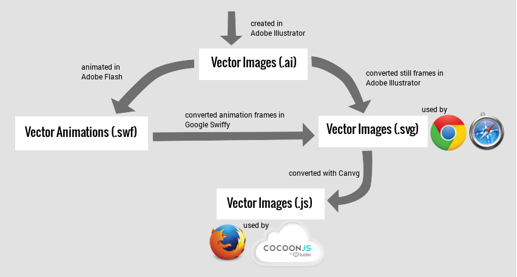
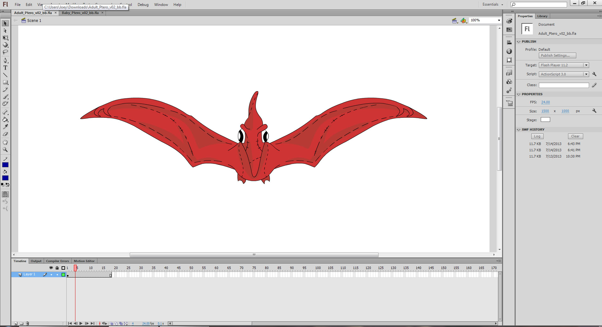
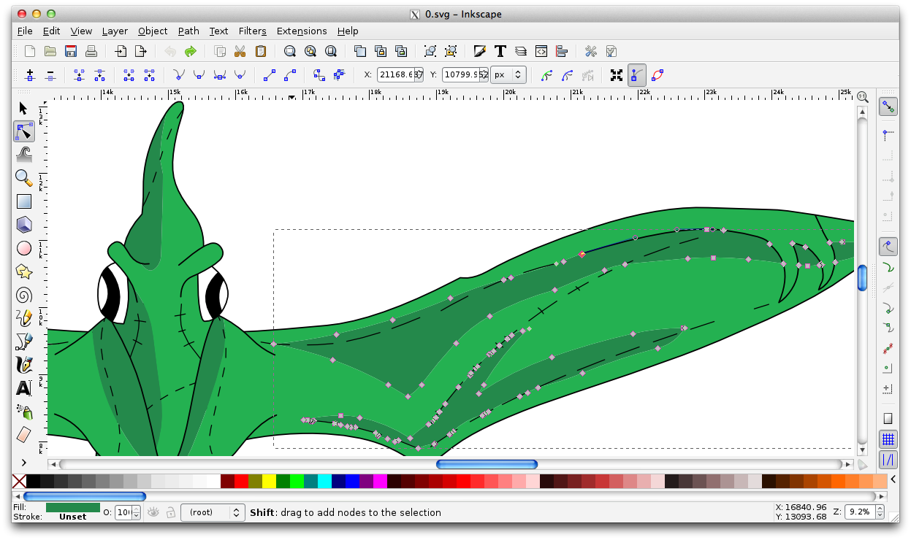
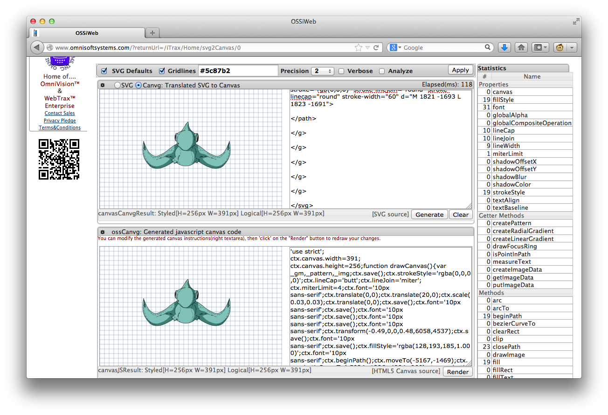

# Textures

We discussed previously how to position images on the screen, but in this
section we will discuss the types of images (textures) we can draw.

Our game engine supports different texture formats.  There are also special
processes to convert the assets from our artists into our engine's supported
formats.  So, this section will go into detail about these formats and
processes.

## Metadata

Every image that we wish to put in our engine must have an associated metadata
file so that the engine knows how to interpret it.  If we have an image named
"logo.png", the engine expects a file named "logo.png.json" that will describe
its type and any additional information required to parse it.

## Bitmaps vs Vectors

There are two types of texture formats: bitmaps and vectors.  Let's look at
their differences.

### Composition

Bitmaps (e.g. PNG, JPG) are the conventional textures that are composed of
uniformly-sized squares called pixels.  Vector textures (e.g. SVG) are instead
composed of a wide variety of curves and other shapes.

### Scaling

The most noticeable benefit of vector textures is that they inherently retain
their quality across different scales.  This helped us to retain detail for the
pterodactyls as they came flying toward the screen.

### Overdraw

As a rule of thumb, you want to reduce the amount of pixels you draw, even
transparent ones!  Drawing pixels is expensive.

When we draw a bitmap to the screen, we are not able to skip the drawing of its
transparent pixels.  So the cost incurred by drawing a bitmap is proportional
to the entire area of the image.  But with vector images, we are only drawing
pixels within the area of its curves.  This allows us to reduce the amount of
pixels that we draw and makes our game faster.

For example, our backgrounds environments are composed of multiple large
layers.  In the visualization below, you can compare the amount of overdrawing
that occurs for bitmaps versus vectors.  A bright red indicates a higher
overdrawing pixel density.

### Memory

Using vectors also saves us texture memory since we are just storing vertices
and colors for the shapes.  Even though PNG and JPG bitmaps are very well
compressed, they must be decompressed when stored in video memory.

To visualize this, the memory usage of a bitmap texture is proportional to its
area, whereas the memory usage of a vector texture is proportional to its
perimeter.  You can see the memory usage in blue below.

## Bitmap Workflow

For the most part, the bitmaps used in the game are stored separately from one
another, as distinct PNG images.

### Sizing

The bitmap texture dimensions in memory must always be a power of 2.  We can
always skirt this restriction by adding empty padding to meet the next highest
power of 2.  But to minimize wasted texture memory we must downscale our images
to the nearest power of 2 or simply design them to be that size.

To visualize the space of possible texture sizes, see the grid below.  This
grid pattern continues to a max size of 2048 or even 4096 on some mobile
devices.

### Packing

There are benefits to packing multiple textures into a single texture.
Sometimes it helps with asset management to logically group related textures by
combining them, especially frames of an animation.  It may also help with
texture memory if you can pack a lot of small textures together.

But perhaps most important is the fact that texture binding is expensive.  To
draw a texture, you must first bind it.  So if you are drawing multiple
textures, you will increase performance if you only have to do a single bind to
draw them all.

The google-able word to describe these types of textures is "texture atlas".
But I use very specific types of texture atlases which I call "tables" and
"mosaics" described in the next section.

### Tables

Tables were used in the first iteration of our texture packing tools.  A table
has a number of rows and columns.  It consists of uniformly-sized cells to
house separate textures.

The example below is illustrates how we initially used a table to store the
animation frames for the baby pterodactyl.  (We later dropped this when we
moved to vector images).  Since each cell is the same size, we are able to
deduce the position and size of each cell with a small amount of information in
its metadata file.

### Mosaics

We define a "mosaic" as a densely packed texture of variously-sized cells.  We
used this to aggressively decrease the footprint of certain animated bitmaps.
For example, you can see how we stored an explosion animation below.  The
"mosaic" is on the left and the animation on the right is pieced together from
mosaic cells.

We created a tool for authoring these mosaics.  The tool accepts a series of
images as input.  It then isolates contiguous regions of each image, performs a
smart-merging strategy of those contiguous regions, then packs all the regions of
all the images into a single image.  It also creates a metadata file noting the
locations of each region and their original locations in their source images.

[The Mosaic tool is available here on GitHub.](https://github.com/shaunlebron/HygoonMosaic)

### Fonts

We initially used TrueType fonts in our game, but profiling our game revealed
that they are very slow to draw.  So we purchased [Glyph
Designer](http://71squared.com/en/glyphdesigner) to help create customized
bitmap fonts for use in our game.  We were able to create a script to convert
their metadata file to a "mosaic" metadata file for use in our engine.

## Vector Workflow

Getting vectors into the game was a difficult challenge.  Our artists were
producing assets in different formats that needed to be displayed in the engine
somehow.

I created a workflow of tools to take SWF and SVG files and convert them into
the different formats we needed for each browser and CocoonJS.

In Firefox and CocoonJS, we use the Canvas Path API to draw vectors.  In webkit
browsers, we use SVG.  See the diagram below for a summary of the pipeline.

### SWF

The pterodactyl animations were done in Adobe Flash (see below) and were exported
to me in SWF format.

I was able to upload the SWF to [Google Swiffy's web
interface](https://www.google.com/doubleclick/studio/swiffy/) to produce an
HTML5 page.  To extract the the SVG frames from this page, I wrote a script
that you can find here: <https://gist.github.com/shaunlebron/7904683>

I fear that this pipeline will be broken in the future since it relies on
Google Swiffy which may be shut down.  There is no source code available for
their SWF to SVG conversion.

### SVG

All the still vector images that we use are exported in SVG format from Adobe
Illustrator, which are sometimes edited slightly in Inkscape (see below).  As
discussed in the previous section, the animated SWF vector frames are exported
to SVG with Swiffy.

The SVG format is a standard vector image format that web browsers can display.
Incidentally, SVG images can be drawn natively onto an HTML5 canvas in
browsers, particularly well on Webkit.  So for webkit browsers, we directly use
the SVG images when drawing to the screen.

The Firefox browser seems to choke on large SVG images and CocoonJS has no
support for them, so we must further convert SVG to another format in order to
draw them for these platforms.

### Canvas Paths

Canvas paths are vector images that are drawn with Canvas Path API.  It is
supported by all browsers and CocoonJS as well.  The SVG format is very close
to the primitives supported by Canvas Paths, so the folks at
[canvg](http://code.google.com/p/canvg/) created a project for rendering SVG on
with canvas paths.  I used a [repurposed version of this
tool](http://www.omnisoftsystems.com/?returnUrl=/iTrax/Home/svg2Canvas/0) for
easing the conversion process.  I also stripped out the essential parts of it
to use as an offline backup for our pipeline:
<https://github.com/shaunlebron/Svg2Canvas>

#### Concerning future Path objects

The [HTML Canvas spec includes Path
objects](http://www.whatwg.org/specs/web-apps/current-work/multipage/the-canvas-element.html#path-objects)
for caching path definitions so they can be drawn multiple times without
calling the string of functions to rebuild it.  It even includes a constructor
spec that will build one from an SVG.

CocoonJS supports a subset of this Path object spec, not including the easy SVG
conversion constructor, whereas browsers have been slow to implement it.
Safari 7 is the first browser to support it, and it came out 43 days ago at the
time of this writing.

#### Peculiarities of CocoonJS vector drawing

I believe CocoonJS converts these canvas paths to vertex lists in OpenGL, at
some sampling frequency. There is a noticeable delay when you first try to draw
a vector image in the game, so to prevent those delays from disrupting the
gameplay, I draw all the pterodactyls for a given level at the very beginning
in an attempt to "cache" whatever vector information is needed to smoothly draw
them in later frames.

It is also worth nothing that CocoonJS does not support anti-aliasing of vector
paths, meaning edges are jagged with visible pixel artifacts.  Thankfully, this
effect is ameliorated by the Retina screens on iPhone and iPad.  But you can
see the comparison below between the game in a browser (left) and the game on
mobile through CocoonJS (right).  You may need to view full size of the image
to notice:

Path objects are also blended additively rather than the usual alpha-blending
in CocoonJS.  This is an issue I have reported to Ludei's support team.
